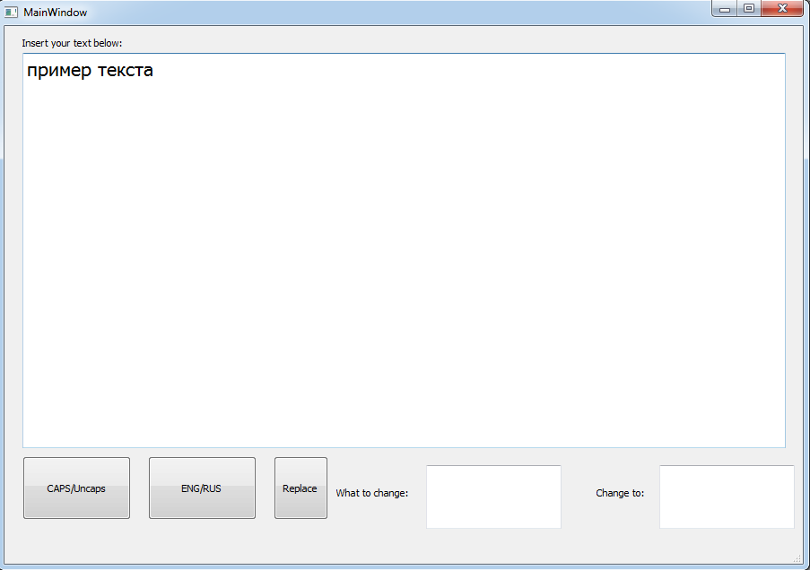
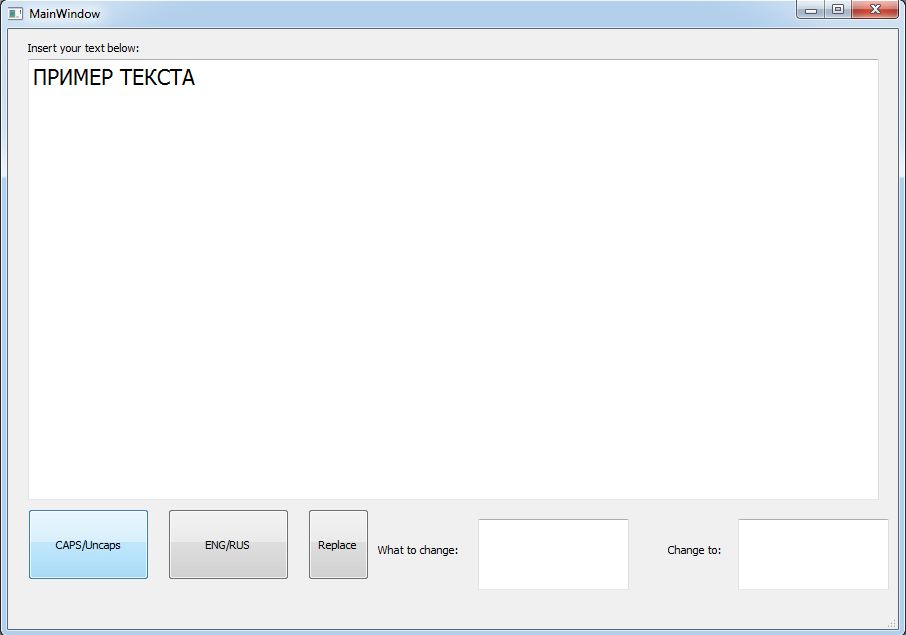
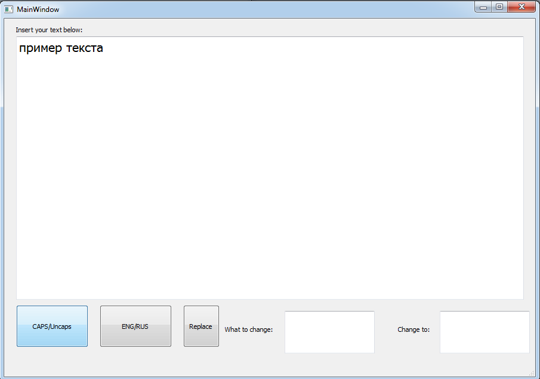
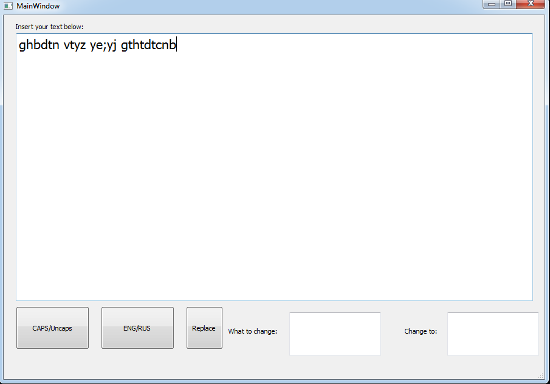
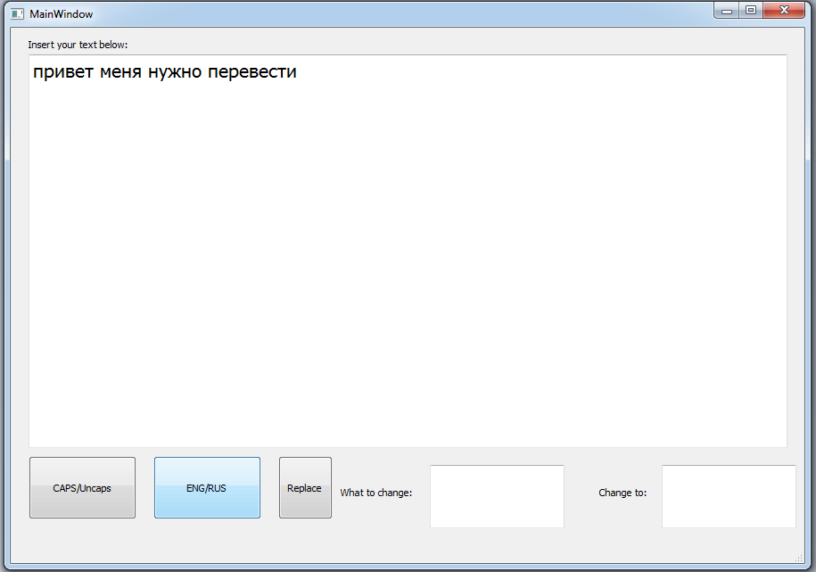
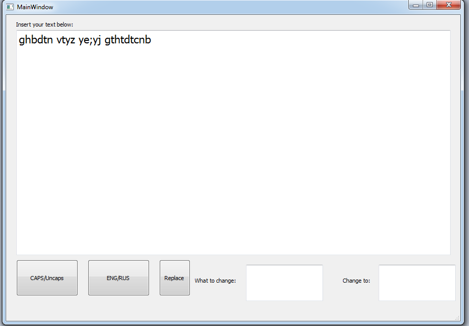
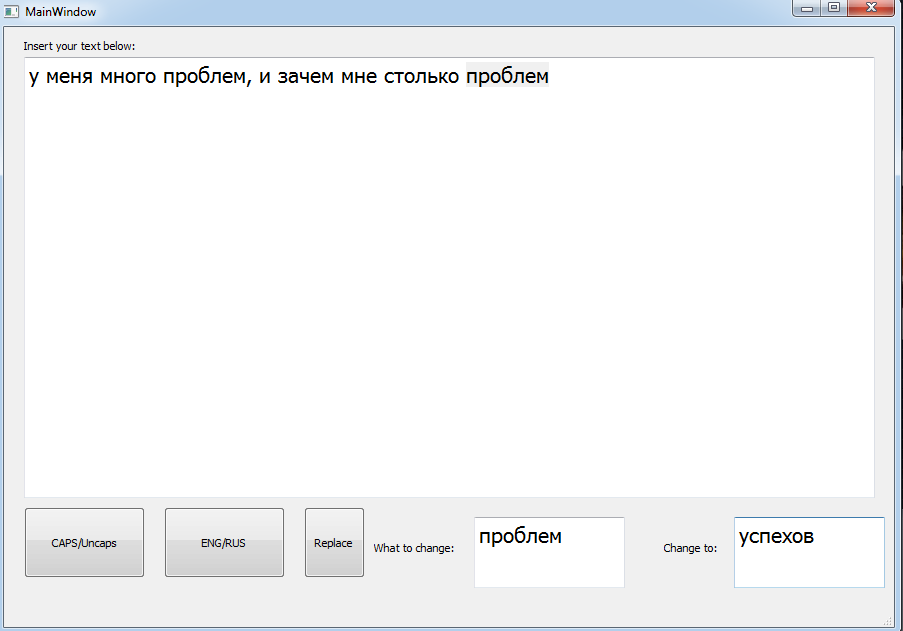
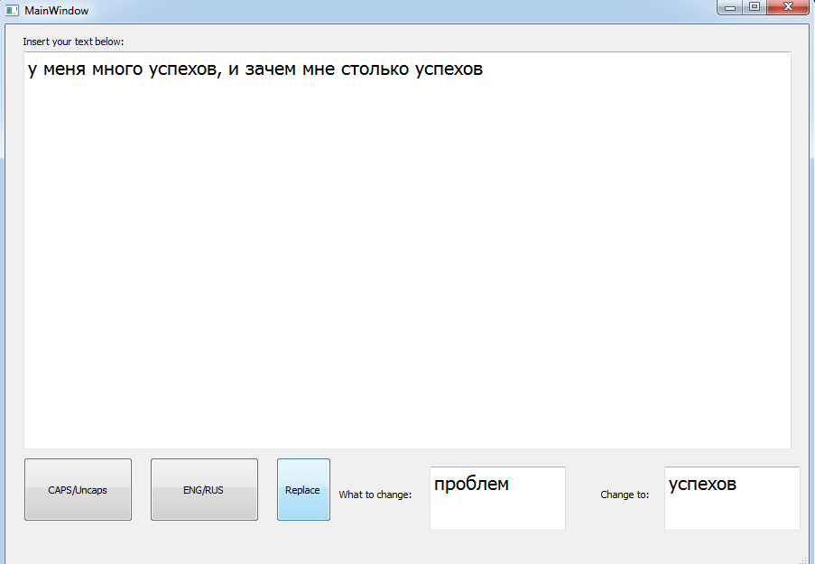

# Uber-Transform

### Функционал
Утилита, которая позволяет:
1. Переводить текст из символов нижнего регистра в символы верхнего регистра и наоборот из верхнего регистра в нижний регистр. 
Пример работы:

 
Рис. 1.1 Имеем текст нижнего регистра, нажимаем кнопку <i>CAPS/Uncaps</i>

 
Рис. 1.2 После нажатия кнопки <i>CAPS/Uncaps</i> получаем в поле ввода текст в верхнем регистре, нажмем кнопку еще раз <i>CAPS/Uncaps</i>

 
Рис. 1.3 В итоге получаем изначальный текст в нижнем регистре

2. Переводить текст из символов латинници в кириллицу и наоборот. 

Пример работы:

 
Рис. 2.1 Имеем текст введенный латинскими символами, для перевода их в кириллические символы нажимаем кнопку <i>ENG/RUS</i>

 
Рис. 2.2 После нажатия кнопки <i>ENG/RUS</i> получаем в поле ввода текст кириллическими сиимволами, нажмем кнопку <i>ENG/RUS</i> еще раз 

 
Рис. 2.3 В итоге получаем изначальный текст латинскими символами

3. Замена в тексте части текста.
Пример работы:

 
Рис. 3.1 Имеем текст введенный в основное поле, для замены части текста необходимо ввести в поле <i>What to change</i> текст который нужно заменить, а в поле <i>Change to</i> текст на который мы заменяем и нажать кнопку <i>Replace</i>

 
Рис. 3.2 После нажатия кнопки <i>Replace</i> получаем в поле ввода текст измененный текст 

